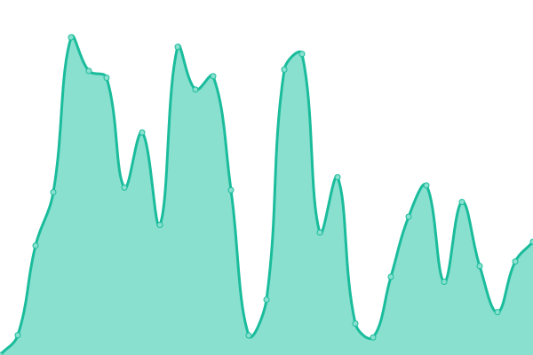

# [📈 Live Status](https://status.gigadrive.network): <!--live status--> **🟧 Partial outage**

This repository contains the open-source uptime monitor and status page for [Gigadrive UG](https://gigadrivegroup.com), powered by [Upptime](https://github.com/upptime/upptime).

With [Upptime](https://upptime.js.org), you can get your own unlimited and free uptime monitor and status page, powered entirely by a GitHub repository. We use [Issues](https://github.com/Gigadrive/status.gigadrive.network/issues) as incident reports, [Actions](https://github.com/Gigadrive/status.gigadrive.network/actions) as uptime monitors, and [Pages](https://status.gigadrive.network) for the status page.

<!--start: status pages-->
<!-- This summary is generated by Upptime (https://github.com/upptime/upptime) -->
<!-- Do not edit this manually, your changes will be overwritten -->
<!-- prettier-ignore -->
| URL | Status | History | Response Time | Uptime |
| --- | ------ | ------- | ------------- | ------ |
|  [MCSkinHistory](https://mcskinhistory.com) | 🟥 Down | [mc-skin-history.yml](https://github.com/Gigadrive/status.gigadrive.network/commits/HEAD/history/mc-skin-history.yml) | 

 101ms
     
 | 

<a href="https://status.gigadrive.network/history/mc-skin-history">0.00%</a>
    

|  [MCSkinHistory Textures](https://tx.mcskinhistory.net) | 🟩 Up | [mc-skin-history-textures.yml](https://github.com/Gigadrive/status.gigadrive.network/commits/HEAD/history/mc-skin-history-textures.yml) | 

 313ms
     
 | 

<a href="https://status.gigadrive.network/history/mc-skin-history-textures">100.00%</a>
    

|  [Gigadrive Accounts](https://old.gigadrivegroup.com) | 🟩 Up | [gigadrive-accounts.yml](https://github.com/Gigadrive/status.gigadrive.network/commits/HEAD/history/gigadrive-accounts.yml) | 

 574ms
     
 | 

<a href="https://status.gigadrive.network/history/gigadrive-accounts">100.00%</a>
    

|  [Gigadrive API v1](https://api.gigadrivegroup.com) | 🟩 Up | [gigadrive-api-v1.yml](https://github.com/Gigadrive/status.gigadrive.network/commits/HEAD/history/gigadrive-api-v1.yml) | 

 503ms
     
 | 

<a href="https://status.gigadrive.network/history/gigadrive-api-v1">99.60%</a>
    

|  [Gigadrive API v3](https://old.gigadrivegroup.com/api/v3/user) | 🟩 Up | [gigadrive-api-v3.yml](https://github.com/Gigadrive/status.gigadrive.network/commits/HEAD/history/gigadrive-api-v3.yml) | 

 139ms
     
 | 

<a href="https://status.gigadrive.network/history/gigadrive-api-v3">100.00%</a>
    

|  [Gigadrive CDN (Legacy)](https://cdn.gigadrivegroup.com) | 🟩 Up | [gigadrive-cdn-legacy.yml](https://github.com/Gigadrive/status.gigadrive.network/commits/HEAD/history/gigadrive-cdn-legacy.yml) | 

 314ms
     
 | 

<a href="https://status.gigadrive.network/history/gigadrive-cdn-legacy">100.00%</a>
    

|  [Crowdlate](https://crowdlate.net) | 🟩 Up | [crowdlate.yml](https://github.com/Gigadrive/status.gigadrive.network/commits/HEAD/history/crowdlate.yml) | 

 427ms
     
 | 

<a href="https://status.gigadrive.network/history/crowdlate">100.00%</a>
    

<!--end: status pages-->

[**Visit our status website →**](https://status.gigadrive.network)

## 📄 License

- Powered by: [Upptime](https://github.com/upptime/upptime)
- Code: [MIT](./LICENSE) © [Gigadrive UG](https://gigadrivegroup.com)
- Data in the `./history` directory: [Open Database License](https://opendatacommons.org/licenses/odbl/1-0/)
